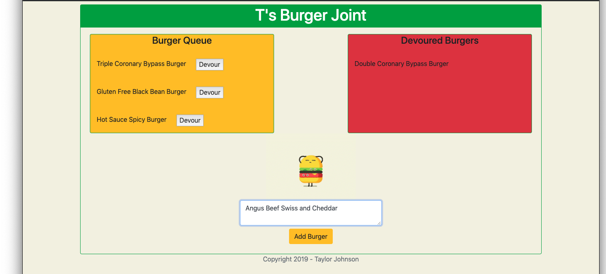

# Homework 12: Eat-Da-Burger! 
This is Taylor Johnson's Homework 12 - Eat-Da-Burger! for the Georgia Tech Coding Boot Camp.

Eat-Da-Burger! is a simple Express web application which utilizes a MySQL data source, an Express/Node backend, and jQuery/Bootstrap frontend. The application retrieves a list of burgers from the database that have not been eaten yet or devoured by invoking the Burgers API GET request. These burgers are displayed to the user in the Burger Queue displayed in the browser.

If the user wants to eat a specific burger, then he can click the Devour button next to the burger. This will move the devoured burger to the Devoured Burgers list. It will also update the devoured boolean in the database for the burger by invoking the Burgers API PUT request. If the application reloads, the burger will no longer display in the Burger Queue.

If the user wants to add a burger to the Burger Queue, he can do so by entering the name of the burger in the form and clicking the Add Burger button. The burger will then be added to the Burger Queue. It will also be added to the database by invoking the Burgers API POST request.



## Libraries/Packages Used
1. Vanilla JavaScript
2. Node.js
3. Express.js
4. Path.js
5. Bootstrap
6. jQuery
7. Sequelize
8. Sequelize-CLI
9. MySQL
10. MySQL2
11. FS

## Burgers API Methods

### GET Burgers -- Retrieve All Burgers
**Description:** Retrieves all burgers in the database
**Request Method:** GET\
**Request URI:** /burger

**JSON Request Model:** There are no request parameters that need to be specified in the request body

**JSON Response Model:**
```json
[
    {
        "id": 12,
        "name": "Double Coronary Bypass Burger",
        "devoured": false,
        "createdAt": "2019-09-02T07:35:57.000Z",
        "updatedAt": "2019-09-02T07:35:57.000Z"
    },
    {
        "id": 13,
        "name": "Triple Coronary Bypass Burger",
        "devoured": false,
        "createdAt": "2019-09-02T07:35:57.000Z",
        "updatedAt": "2019-09-02T07:35:57.000Z"
    }
]
```

**ID:** System generated auto-incrementing identifier (primary key)\
**Name:** Name of the burger\
**Devoured:** Boolean which indicates if the burger has been eaten (aka devoured)\
**Created At:** Timestamp generated by the system when the burger was created\
**Updated At:** Timestamp generated by the system when the burger was last updated


### POST Burgers -- Add New Burger
**Description:** Creates a new burger record in the database
**Request Method:** POST\
**Request URI:** /burger

**JSON Request Model:**
```json
{
	"name": "Southwest Spicy Cheeseburger"
}
```

**Name:** Name of the new burger to be added to database

**JSON Response Model:**
```json
{
    "devoured": false,
    "id": 6,
    "name": "Southwest Spicy Cheeseburger",
    "updatedAt": "2019-09-02T05:46:53.617Z",
    "createdAt": "2019-09-02T05:46:53.617Z"
}
```

**ID:** System generated auto-incrementing identifier (primary key)\
**Name:** Name of the burger\
**Devoured:** Boolean which indicates if the burger has been eaten (aka devoured)\
**Created At:** Timestamp generated by the system when the burger was created\
**Updated At:** Timestamp generated by the system when the burger was last updated


### PUT Burgers - Update Devoured Status
**Description:** Updates the devoured status of an existing burger in the databse (devoured == TRUE)
**Request Method:** PUT\
**Request URI:** /burger

**JSON Request Model:**
```json
{
	"id": 2
}
```

**ID:** ID of the burger that will have devoured status set to TRUE

**JSON Response Model:**
```json
[
    1
]
```

**Output:** Outputs the binary form of the new devoured boolean (0 = false; 1 = true)